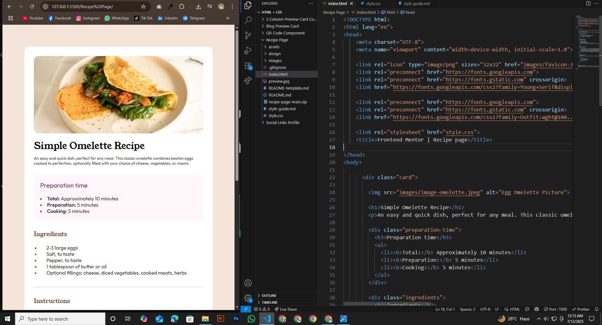

# Frontend Mentor - Recipe Page Challenge

This is a solution to the [Recipe Page Challenge](https://www.frontendmentor.io/challenges/recipe-page-KiTsR8QQKm) on [Frontend Mentor](https://www.frontendmentor.io/challenges/qr-code-component-iux_sIO_H). Frontend Mentor challenges help me improve my coding skills by building realistic projects.

## Table of contents

- [Overview](#overview)
  - [Screenshot](#screenshot)
  - [Project Links](#links)
- [My Process](#my-process)
  - [Built with](#built-with)
  - [What I learned](#what-i-learned)
  - [Continued development](#continued-development)
  - [Useful resources](#useful-resources)
- [Author](#author)
- [Acknowledgments](#acknowledgments)


## Overview

### Screenshot





### Links

- Solution URL: (https://github.com/hemal6325/Recipe-Page-Challenge)
- Live Site URL: (https://hemal6325.github.io/Recipe-Page-Challenge/)

## My Process
I built this project using HTML and CSS, focusing on layout design and responsive styling. Through it, I learned Flexbox, Semantic Markup, and how to create visually balanced components.

### Built With

- HTML5 Semantic Structure
- CSS3 Custom Properties
- Flexbox
- Mobile First Workflow


### What I Learned

During this experience, I gained valuable skills and deeper understanding of the subject. It helped me improve my problem-solving abilities and boosted my confidence in applying new concepts.


```css
:root{
    --primaryFont: "Young Serif", serif;
    --secondaryFont: "Outfit", sans-serif;

    --fontSize: 16px;

    --White: hsl(0, 0%, 100%);
    --Stone100: hsl(30, 54%, 90%);
    --Stone150: hsl(30, 18%, 87%);
    --Stone600: hsl(30, 10%, 34%);
    --Stone900: hsl(24, 5%, 18%);
    --Brown800: hsl(14, 45%, 36%);
    --Rose800: hsl(332, 51%, 32%);
    --Rose50: hsl(330, 100%, 98%);
}

*,
*::after,
*::before{
    margin: 0;
    padding: 0;
    box-sizing: border-box;
}

html, body{
    min-height: 100%;
}

body{
    display: flex;
    flex-direction: column;
    justify-content: center;
    align-items: center;
    background: var(--Stone100);
    padding: 30px;
    margin: 40px;
}

h1{
    font-family: var(--primaryFont);
    color: black;
}
h3{
    font-family: var(--primaryFont);
    font-weight: 400;
    color: var(--Brown800);
}

.card{
    background: var(--White);
    justify-content: center;
    align-items: center;

    padding: 30px;
    width: 600px;
    border-radius: 15px;
}

.card img{
    width: 540px;
    height: auto;
    border-radius: 15px;
}

.card h1{
    margin-top: 15px;
    font-size: 30px;
    font-family: var(--primaryFont);
    font-weight: 400;
}

.card p{
    margin-top: 10px;
    margin-bottom: 30px;
    font-size: 13px;
    font-family: var(--secondaryFont);
    color: var(--Stone900);
}

.card .preparation-time{
    background: var(--Rose50);
    border-radius: 13px;
}

.card .preparation-time h3{
    padding: 20px;
    font-size: 20px;
    font-family: var(--secondaryFont);
    color: var(--Rose800);
}

.card .preparation-time ul{
    list-style-type: disc;
    list-style-position: inside;
    color: var(--Stone900);
    padding-left: 20px;
    padding-bottom: 20px;
}

.card .preparation-time li{
    font-family: var(--secondaryFont);
    font-size: 16px;
}

.card .preparation-time li::marker{
    color: var(--Rose800);
}

.card .preparation-time li b{
    font-weight: 600;
}

.card .ingredients{
    margin-top: 30px;
}

.card .ingredients ul{
    font-family: var(--secondaryFont);
    font-size: var(--fontSize);
    font-weight: none;
    color: var(--Stone900);
    list-style-type: disc;
    list-style-position: outside;
    padding: 20px;
}

.card .ingredients li{
    font-size: var(--fontSize);
    font-family: var(--secondaryFont);
    padding-left: 20px;
}

.card .ingredients li::marker{
    color: var(--Brown800);
}

.card .ingredients hr{
    opacity: 50%;
    margin-top: 15px;
    margin-bottom: 15px;
}

.card .instructions{
    margin-top: 30px;
}

.card .instructions ul{
    font-family: var(--secondaryFont);
    font-size: var(--fontSize);
    font-weight: none;
    color: var(--Stone900);
    list-style-type: decimal;
    list-style-position: outside;
    padding: 20px;
}

.card .instructions li{
    font-size: var(--fontSize);
    font-family: var(--secondaryFont);
    padding-left: 20px;
}

.card .instructions li::marker{
    color: var(--Brown800);
}

.card .instructions hr{
    opacity: 50%;
    margin-top: 15px;
    margin-bottom: 15px;
}

.card .nutrition{
    margin-top: 30px;
    align-items: center;
    justify-content: space-between;
}

.card .nutrition p{
    margin-bottom: 30px;
    font-size: 13px;
    font-family: var(--secondaryFont);
    color: var(--Stone900);
}

.card .nutrition article ul{
    list-style: none;
    padding: 0;
}

.card .nutrition article ul li{
    display: flex;
    align-items: center;
    font-family: var(--secondaryFont);
    font-size: var(--fontSize);
    justify-content: space-around;
    border-bottom: 1px solid var(--Stone150);
    padding: 8px 0;
}

.card .nutrition article ul li:last-child{
    border-bottom: none;
}

.card .nutrition article ul li b{
    color: var(--Rose800);
}

.attribution{ 
    font-family: var(--primaryFont);
    font-size: 16px; 
    text-align: center; 
    margin-top: 40px;
}

.attribution a{ 
    color: hsl(228, 45%, 44%); 
    text-decoration: none;
    font-family: var(--secondaryFont);
    font-weight: 600;
}


@media screen and (max-width: 375px) {
    
}

```

### Continued Development

I would like to make my own QR Generator so this could be used as a default template. The qr code could be links to a document or something along those ways. Going to think about something useful that could come in handy.

### Useful Resources

- [FLEXBOX FROGGY](https://flexboxfroggy.com/) - This helped me to understand better how to use flexbox.


## Author

- Frontend Mentor - [@hemal6325](https://www.frontendmentor.io/profile/hemal6325)
- GitHub Profile - [@hemal6325](https://github.com/hemal6325/)

## Acknowledgments


At some point i was a little stuck with setting the style for the image. And i solved this problem using online Resources, ChatGPT & Google Bard.


**Have Fun Building!** 🚀
